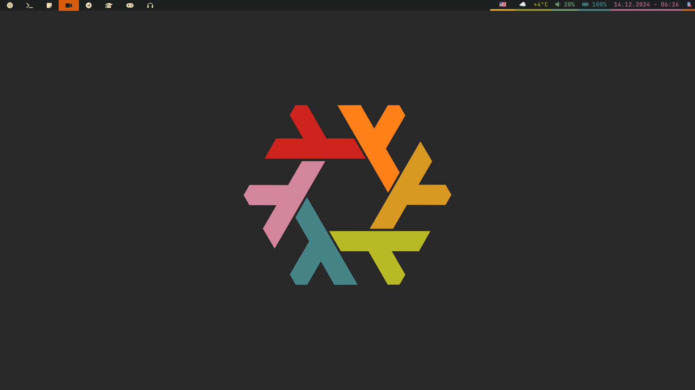
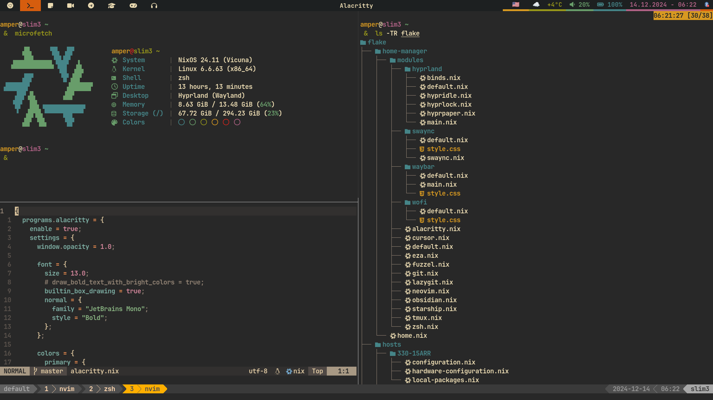

# ❄️ NixOS Config Reborn

Welcome to my redesigned NixOS configuration built for efficiency and aesthetics. Right now I'm trying to commit something everyday. Let's see how long I can go.




## ✨ Features

- 🖥️ **Multiple Hosts Support**: Easy to configure for different hosts.
- 🎨 **Gruvbox Theme**: A perfect blend of vibrant and subtle colors.
- 🪟 **Hyprland + Waybar**: 10/10 window compositor on Wayland.
- 🏠 **Home Manager Integration**: lots of stuff configured.
- 🧇 **Tmux**: with my own hotkeys.
- 🌟 **Zsh + starship**: Efficient shell setup with lots of aliases.

### Hyprland Keybindings

Some of the most useful keybindings (Mod is SUPER key):

| Keybinding          | Action                                         |
|---------------------|------------------------------------------------|
| `Mod + SHIFT + Enter` | Open Terminal (alacritty)                      |
| `Mod + SHIFT + C`   | Close Active Window                            |
| `Mod + SHIFT + Q`   | Exit Hyprland                                  |
| `Mod + R`           | Open File Manager (ranger)                     |
| `Mod + D`           | Application Menu (wofi --show drun)            |
| `Mod + E`           | Emoji Selector (bemoji)                        |
| `Mod + V`           | Clipboard History (cliphist via wofi)          |
| `Mod + L`           | Lock Session                                   |
| `Mod + P`           | Show Keybindings Cheatsheet (wofi)             |
| `Mod + SHIFT + P`   | Color Picker (hyprpicker)                      |
| `PrintScreen`       | Screenshot Area (grimblast)                    |
| `Mod + Arrows`      | Move Focus                                     |
| `Mod + SHIFT + Arrows`| Swap Window                                    |
| `Mod + CTRL + Arrows` | Resize Window                                  |
| `Mod + [1-9,0]`     | Switch Workspace                               |
| `Mod + SHIFT + [1-9,0]`| Move Window to Workspace                     |
| `Mod + S`           | Toggle Special Workspace (scratchpad)          |
| `Mod + SHIFT + S`   | Move Active Window to Special Workspace        |

For a full list, press `Mod + P` to see the cheatsheet.

### Power Management (TLP)

- Click the **battery icon** in Waybar to toggle between TLP power modes:
    - **AC Mode**: Performance-oriented settings, active when on AC power or manually selected.
    - **Battery Mode**: Power-saving settings, active when on battery power or manually selected.
- TLP settings (governors, charge thresholds, etc.) are configured in `nixos/modules/power.nix`.
- `thermald` is also enabled for system thermal management.

## 🚀 Installation

To get started with this setup, follow these steps:

1. **Install NixOS**: If you haven't already installed NixOS, follow the [NixOS Installation Guide](https://nixos.org/manual/nixos/stable/#sec-installation) for detailed instructions.
2. **Clone the Repository**:

	```bash
    git clone https://github.com/Andrey0189/nixos-config-reborn
    cd nixos-config-reborn
    ```

3. **Copy one of the hosts configuration to set up your own**:

    ```bash
    cd hosts
    cp -r slim3 <your_hostname>
    cd <your_hostname>
    ```

4. **Put your `hardware-configuration.nix` file there**:

    ```bash
    cp /etc/nixos/hardware-configuration.nix ./
    ```

5. **Edit `hosts/<your_hostname>/local-packages.nix` and `nixos/packages.nix` files if needed**:

    ```bash
    vim local-packages.nix
    vim ../../nixos/packages.nix
    ```

6. **Finally, edit the `flake.nix` file**:

    ```diff
    ...
      outputs = { self, nixpkgs, home-manager, ... }@inputs: let
        system = "x86_64-linux";
    --  homeStateVersion = "24.11";
    ++  homeStateVersion = "<your_home_manager_state_version>";
    --  user = "amper";
    ++  user = "<your_username>";
        hosts = [
    --    { hostname = "slim3"; stateVersion = "24.05"; }
    --    { hostname = "330-15ARR"; stateVersion = "24.11"; }
    ++    { hostname = "<your_hostname>"; stateVersion = "<your_state_version>"; }
        ];
    ...
    ```

7. **Rebuilding**:

    ```bash
    cd nixos-config-reborn
    git add .
    sudo nixos-rebuild switch --flake .#<hostname>
    # or nixos-install --flake .#<hostname> if you are installing on a fresh system
    home-manager switch .
    ```

8. **Updates**
```bash
cd nixos-config-reborn
git fetch # Рекомендуется для получения последних изменений из удаленного репозитория перед обновлением
git pull # Если вы хотите слить изменения
sudo nixos-rebuild switch --flake .#<hostname>
home-manager switch . 
```

## 😎 Enjoy!



## 🤝 Contributions

Feel free to fork the repository and submit pull requests if you'd like to contribute improvements. Open issues if you encounter any problems with the config or have ideas for new features.

## ! Its fork from original creator for redmibook 2024 pro 

